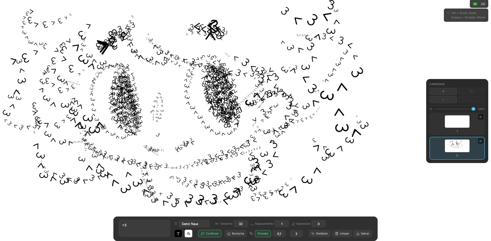
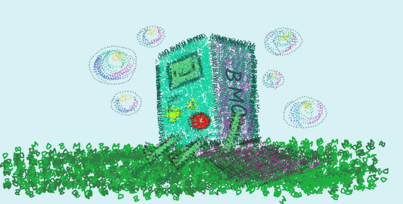

# Grapho

[](https://www.gnu.org/licenses/gpl-3.0)
[](https://nodejs.org/)
[](https://vitejs.dev/)

Paint text along freehand paths on a canvas. Characters follow the direction of the stroke and repeat seamlessly. Full undo/redo, zoom & pan, export as PNG.





## Installation

1. **Clone the repository**

   ```bash
   git clone https://github.com/yourusername/grapho.git
   cd grapho
   ```

2. **Install dependencies**

   ```bash
   npm install
   ```

3. **Start development server**

   ```bash
   npm run dev
   ```

